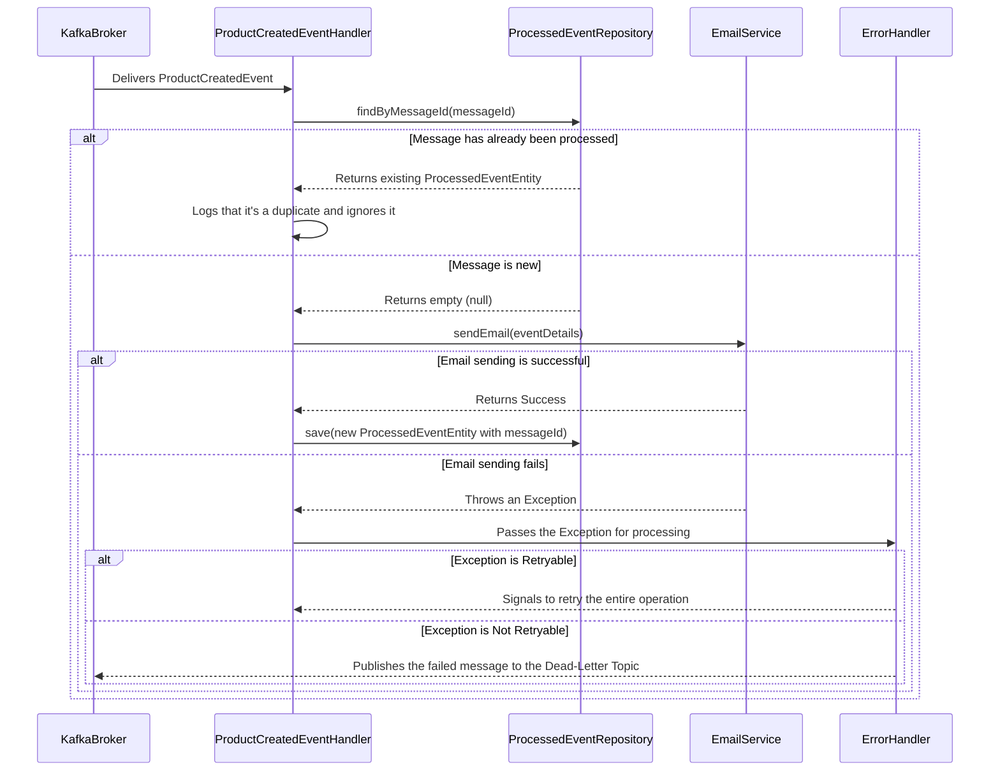

# Email Notification Microservice Documentation

## 1. Introduction

Welcome to the documentation for the Email Notification Microservice. This document provides a comprehensive overview of the application, its architecture, and its core functionalities. It is intended for developers, architects, and anyone interested in understanding how the microservice works.

### 1.1. What is this Microservice?

The Email Notification Microservice is a specialized, independent service built using **Java** and the **Spring Boot** framework. Its primary function is to send email notifications in response to specific events that occur within a larger, distributed system. In its current form, it is configured to listen for a `ProductCreatedEvent` on an **Apache Kafka** topic. When it receives this event, it processes the information and dispatches an email.

This microservice is engineered for **resilience and fault tolerance**, incorporating essential patterns for modern distributed systems, such as:

- **Idempotent Message Processing:** Prevents duplicate processing of the same message, ensuring that an action (like sending an email) is performed only once, even if the message is received multiple times.
- **Retry and Dead-Letter Queue (DLQ) Mechanisms:** Provides sophisticated error handling. It can retry operations that fail due to transient issues and move messages that consistently fail to a separate queue for manual inspection, preventing data loss.

### 1.2. Who is this Documentation For?

This documentation is designed for a wide audience:
- **New Developers:** To quickly get up to speed with the application's purpose, architecture, and setup.
- **System Architects:** To understand how this microservice fits into a larger ecosystem and its key design patterns.
- **DevOps Engineers:** To learn how to build, deploy, and monitor the application.

No prior knowledge of this specific application is assumed. However, a basic understanding of Java, Spring Boot, and messaging systems like Kafka will be beneficial.

## 2. Core Concepts and Technologies

This microservice is built on a foundation of industry-standard technologies and concepts. Understanding them is key to understanding the application.

### 2.1. Microservice Architecture

This application is a **microservice**. A microservice architecture structures an application as a collection of small, autonomous services. Each service is self-contained and focuses on a single business capability.

**Key Characteristics:**
- **High Cohesion:** Each microservice is responsible for a specific business domain (e.g., email notifications).
- **Loose Coupling:** Services are independent. A change in one service does not force other services to be redeployed. They communicate over well-defined APIs, such as REST or a message broker.
- **Independent Deployability:** You can update and deploy one microservice without affecting the rest of the application.
- **Technology Diversity:** Different microservices can be built with different technologies.

This is in contrast to a **monolithic architecture**, where the entire application is a single, tightly coupled unit.

### 2.2. Apache Kafka: The Messaging Backbone

**Apache Kafka** is a distributed event streaming platform. Think of it as a central nervous system for a distributed application, allowing different services to communicate asynchronously.

**Core Kafka Concepts Used in This Project:**
- **Event:** A record of something that has happened. In our case, a `ProductCreatedEvent` is an event, signifying that a new product was created elsewhere in the system.
- **Topic:** A named stream of events. This microservice listens to a topic named `products-created-events-topic`.
- **Producer:** An application that publishes (sends) events to a Kafka topic.
- **Consumer:** An application that subscribes to (receives) events from a topic. **This microservice is a Kafka consumer.**
- **Consumer Group:** A group of consumers that work together. Kafka ensures that each event in a topic is delivered to only one consumer instance within the group. This is how Kafka achieves load balancing and fault tolerance.

### 2.3. Spring Boot: Simplifying Java Development

**Spring Boot** is a framework that makes it easy to create stand-alone, production-grade Spring-based applications. It takes an "opinionated" view of the Spring platform, which means it comes with sensible defaults and auto-configuration.

**Why Spring Boot?**
- **Auto-configuration:** It automatically configures the application based on the libraries (dependencies) you have in your project. For example, if it sees the `spring-kafka` library, it will automatically set up the necessary beans for Kafka integration.
- **Embedded Servers:** It includes an embedded web server (like Tomcat), so you can run your application as a simple executable JAR file, without needing to deploy it to an external web server.
- **Starter Dependencies:** It provides "starter" packages that group common dependencies together, simplifying your build configuration. For example, `spring-boot-starter-web` includes everything you need for building a web application.

## 3. Application Architecture

The architecture is designed around an event-driven model, with a central Kafka consumer that processes incoming messages, interacts with a database to ensure data integrity, and handles errors gracefully.

### 3.1. Architectural Diagram

The following diagram illustrates the flow of information and the interaction between the different components of the system.

```mermaid
graph TD
    subgraph "External Systems"
        A[Product Service]
        B[Email Server/Gateway]
    end

    subgraph "Apache Kafka"
        C(products-created-events-topic)
        D(products-created-events-topic.DLT)
    end

    subgraph "Email Notification Microservice"
        E[ProductCreatedEventHandler]
        F{Idempotency Check}
        G[Business Logic: Send Email]
        H[ProcessedEventRepository]
        I[(H2 Database)]
        J[Error Handler]
    end

    A -- Publishes Event --> C
    E -- Consumes Event --> C
    E --> F
    F -- "Is this a new message?" -->|No| K[Ignore & Log Duplicate]
    F -- "Is this a new message?" -->|Yes| G
    G -- "On Success" --> H
    G -- "On Failure" --> J
    H -- "Save messageId to prevent duplicates" --> I
    J -- "Is the error temporary (retryable)?" --> E
    J -- "Is the error permanent (not retryable)?" --> D
    G -- "Sends Email via" --> B
```

### 3.2. Component Breakdown

- **`EmailNotificationMicroserviceApplication`**: This is the main entry point of the Spring Boot application. The `@SpringBootApplication` annotation enables auto-configuration, component scanning, and other key features.
- **`ProductCreatedEventHandler`**: This is the heart of the microservice. It contains the method that listens for Kafka messages.
    - The `@KafkaListener` annotation designates the `handle()` method as the receiver of incoming messages from the `products-created-events-topic`.
    - It orchestrates the entire process: checking for duplicates, executing the business logic, and handling exceptions.
- **`KafkaConsumerConfiguration`**: This class is responsible for configuring the Kafka consumer. It defines how the application connects to Kafka, how messages are deserialized (converted from bytes to Java objects), and, most importantly, how errors are handled (the retry and DLQ policy).
- **`ProcessedEventEntity`**: This is a **JPA Entity**, which represents a table in a database. It is used to store the unique ID of each message that has been successfully processed. This is the foundation of the idempotency mechanism.
- **`ProcessedEventRepository`**: This is a **Spring Data JPA repository**. It provides an abstraction over the database, allowing the application to easily save and query `ProcessedEventEntity` objects without writing boilerplate SQL code.
- **`RetryableException` & `NotRetryableException`**: These are custom exception classes. They are used to signal to the error handling framework whether a failure is temporary or permanent.
    - `RetryableException`: Thrown for transient errors, like a network timeout. This tells the framework to retry processing the message.
    - `NotRetryableException`: Thrown for permanent errors, like invalid data in the message. This tells the framework to give up and send the message to the Dead-Letter Queue.

## 4. Detailed Application Flow (Step-by-Step)

The application follows a precise sequence of steps to ensure that every message is processed correctly and exactly once.

### 4.1. Sequence Diagram

This diagram shows the sequence of interactions that occur when a new message arrives.



## 5. In-depth: Error Handling Strategy

A robust error handling strategy is critical in a distributed system. This microservice uses a combination of retries and a Dead-Letter Queue.

### 5.1. Retryable vs. Non-Retryable Errors

- **Retryable Errors:** These are temporary failures where it's reasonable to assume that a subsequent attempt might succeed.
    - **Examples:** A temporary network glitch, a database deadlock, or a dependent service being briefly unavailable.
    - **Mechanism:** When a `RetryableException` is thrown, the `DefaultErrorHandler` (configured in `KafkaConsumerConfiguration`) catches it and re-attempts to process the message. The configuration specifies a fixed back-off period (e.g., wait 5 seconds) and a maximum number of retry attempts (e.g., 3 times).

- **Non-Retryable Errors:** These are permanent failures where retrying the same operation will always fail.
    - **Examples:** A message with invalid or missing data (data validation error), a malformed JSON message, or a business rule violation.
    - **Mechanism:** When a `NotRetryableException` is thrown, the message is immediately forwarded to a Dead-Letter Queue without any retry attempts.

### 5.2. The Dead-Letter Queue (DLQ)

A **Dead-Letter Queue (DLQ)**—also known as a Dead-Letter Topic (DLT) in Kafka—is a dedicated topic where messages that fail processing are sent. This is a crucial pattern for several reasons:
- **Prevents Data Loss:** The failed message is not discarded; it's safely stored for later analysis.
- **Maintains System Health:** It prevents a "poison pill" message (a message that always causes an error) from blocking the processing of subsequent messages.
- **Improves Observability:** Developers or support teams can monitor the DLQ to detect problems. The messages in the DLQ contain metadata about the failure (e.g., the original topic, the error message), which helps in diagnosing the root cause.

## 6. In-depth: Idempotency

**Idempotency** is a guarantee that performing an operation multiple times has the same effect as performing it once. In a messaging system like Kafka, which provides "at-least-once" delivery, a message might be delivered more than once (e.g., if a consumer processes a message but crashes before it can acknowledge it).

Without idempotency, processing a duplicate `ProductCreatedEvent` would lead to sending a duplicate email to the user, which is undesirable.

This microservice achieves idempotency through the following mechanism:
1. **Unique Message Identifier:** Every Kafka message is expected to have a unique ID. This ID is passed in the message headers.
2. **Persistence Layer:** A database (H2 in this implementation) is used to keep a record of the unique IDs of all successfully processed messages.
3. **Pre-processing Check:** Before executing the core business logic (sending the email), the service queries the `ProcessedEventRepository` to check if the message's unique ID already exists in the database.
    - If the ID **exists**, the message is a duplicate, and the service logs this and safely ignores it.
    - If the ID **does not exist**, the service proceeds with the business logic. If the logic completes successfully, the message ID is then saved to the database.

This entire "check-and-save" process is wrapped in a single **database transaction** to ensure atomicity, which prevents race conditions (where two instances of the consumer might try to process the same message at the same time).

## 7. Configuration Deep Dive

The application's behavior is configured in the `src/main/resources/application.properties` file.

- **`spring.kafka.consumer.bootstrap-servers=localhost:9092`**: The address of the Kafka broker(s) to connect to.
- **`spring.kafka.consumer.group-id=email-notification-consumer-group`**: The unique name for the consumer group. All instances of this microservice that share this ID will be part of the same group.
- **`spring.kafka.consumer.key-deserializer` & `spring.kafka.consumer.value-deserializer`**: These specify the classes that Kafka uses to convert the raw byte stream from the topic into Java objects (a `String` for the key and a JSON object for the value).
- **`spring.kafka.consumer.properties.spring.json.trusted.packages=*`**: A security feature in Spring Kafka. It tells the JSON deserializer which Java packages are safe to deserialize into. Using `*` is convenient for development but should be restricted to specific packages (e.g., `com.notrlyanurag.ws.core`) in a production environment.
- **`spring.datasource.url`, `username`, `password`**: Standard Spring Data properties for configuring the connection to the H2 in-memory database.
- **`spring.jpa.hibernate.ddl-auto=update`**: A Hibernate property that controls the database schema. The `update` value tells Hibernate to automatically update the database schema to match the JPA entities if there have been any changes since the last run.
- **`retry-attempts`, `retry-interval`, `dlt-topic-name`**: These are custom properties defined for the application to allow for flexible configuration of the error handling mechanism without changing the code.

## 8. How to Run and Test the Application

### 8.1. Prerequisites
- **Java 17** or a later version
- **Apache Maven** (for building the project)
- A running **Apache Kafka** instance

### 8.2. Building the Application
To build the project and package it into an executable JAR file, run the following command from the root directory of the project:
```bash
mvn clean install
```

### 8.3. Running the Application
Once the project is built, you can run it with the following command:
```bash
java -jar target/EmailNotificationMicroservice-0.0.1-SNAPSHOT.jar
```
The application will start up, connect to Kafka, and begin listening for messages.

### 8.4. Running the Automated Tests
The project includes integration tests that use an **embedded Kafka instance**. This means you do not need a separate, running Kafka broker to execute the tests.
To run the tests, use the following Maven command:
```bash
mvn test
```
This will run all the unit and integration tests, ensuring that the core logic of the application is working as expected.
